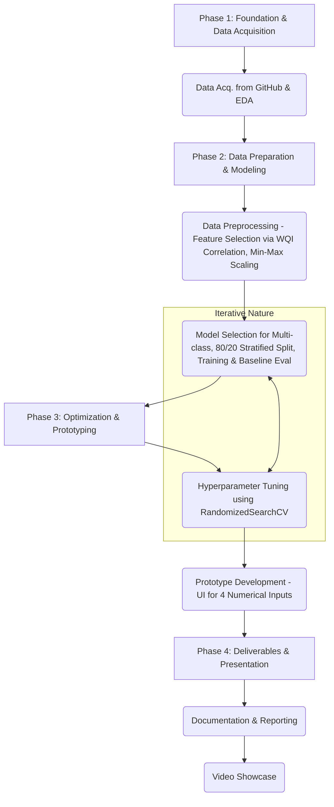

Of course. Here is the detailed plan rewritten to incorporate the specifics from your presentation.

---

### **Detailed Plan: AI for Water Quality Classification (Updated)**

[cite_start]**Primary Dataset:** [GitHub Repository](https://github.com/shahsanjanav/DL-WaterQuality-Classifier) [cite: 3]

**Justification for Choosing this Project:**

1.  [cite_start]**Real-world Impact**: This project is crucial for mitigating significant health risks and environmental damage by enabling timely interventions through rapid, AI-powered water quality assessments[cite: 2].
2.  [cite_start]**Clear Problem Definition**: The inefficiency and high cost of traditional water quality testing methods necessitate an automated, cost-effective solution for rapid water quality classification[cite: 1]. [cite_start]The task is a well-defined multi-class classification problem: predicting the `Water Quality Level` ("Excellent", "Good", "Poor", "Very Poor", "Unsuitable for Drinking") based on chemical properties[cite: 3].
3.  [cite_start]**Data Availability**: The public dataset from GitHub provides a substantial base for model training, containing 19,029 rows and 24 features[cite: 3].
4.  [cite_start]**Alignment with Target Domains**: This project falls squarely within the **Environmental Science** domain, addressing a critical environmental and health challenge with a smart technology solution[cite: 1].

---

**Phase 1: Foundation & Data Acquisition**

1.  **Project Setup & Environment Configuration:**
    * Create a dedicated project directory and initialize a Git repository.
    * Set up a Python virtual environment.
    * Install necessary libraries: `pandas`, `numpy`, `scikit-learn`, `matplotlib`, `seaborn`, and a UI framework like `streamlit`.
2.  **Data Acquisition and Initial Understanding:**
    * Load data from the source into a `pandas` DataFrame.
    * Conduct initial Exploratory Data Analysis (EDA):
        * [cite_start]Confirm dataset dimensions (19,029 rows, 24 features) and data types (`df.info()`)[cite: 3].
        * [cite_start]Identify the key features and the multi-class target variable, `Water Quality Level`[cite: 3].
        * Analyze the distribution of the target variable to understand class balance.
        * **Key EDA Finding**: The dataset was determined to have no missing values or significant outliers, simplifying the preprocessing stage.
        * **Crucial EDA Task**: Analyze the correlation between the features and the `Water Quality Index (WQI)` to inform feature selection.

---

**Phase 2: Data Preparation & Modeling**

3.  **Data Preprocessing:**
    * **Feature Selection**:
        * [cite_start]Based on correlation analysis with the `Water Quality Index (WQI)`, 4 key predictive features were selected: **Electrical Conductivity (EC), Chloride (Cl), Total Dissolved Solids (TDS), and Sodium (Na)**[cite: 3].
        * All other features (20) are excluded from the model to improve efficiency and focus on the most impactful parameters.
    * **Missing Value & Outlier Handling**: No imputation or outlier treatment was required as none were detected during EDA.
    * **Feature Encoding**:
        * The categorical target variable, `Water Quality Level`, is encoded into numerical labels (e.g., Excellent: 1, Good: 2, etc.) for model compatibility.
    * **Feature Scaling**:
        * Normalize the selected numerical features using **Min-Max scaling** to transform them into a [0, 1] range.
4.  **Model Selection, Training, and Baseline Evaluation:**
    * [cite_start]**Data Splitting**: Divide the preprocessed data into training and testing sets using an **80/20 split**[cite: 4].
    * [cite_start]**Crucial Step**: **Stratified sampling** is performed during the split to handle class imbalance and ensure the target class proportions are represented equally in both the training and testing sets[cite: 4].
    * [cite_start]**Model Candidates**: Select a range of models suitable for multi-class classification[cite: 5, 6]:
        * [cite_start]Logistic Regression (using a One-vs-Rest strategy) [cite: 5]
        * [cite_start]Random Forest [cite: 5]
        * [cite_start]Gradient Boosting [cite: 5]
        * [cite_start]k-Nearest Neighbors (kNN) [cite: 5]
        * [cite_start]Naïve Bayes [cite: 6]
        * [cite_start]Perceptron (Multilayer Perceptron - MLP) [cite: 6]
    * **Training**: Train all candidate models on the preprocessed, stratified training data.
    * **Evaluation**: Assess models on the test set using a focused set of metrics:
        * Accuracy
        * Precision, Recall, and **Macro-F1 score**
        * **Confusion Matrix** for detailed class-wise performance visualization.
    * [cite_start]**Feature Importance Analysis**: For tree-based models (Random Forest, Gradient Boosting), extract and analyze feature importances (using Gini/Entropy) to identify which of the four selected features is most influential[cite: 7].

---

**Phase 3: Optimization & Prototyping**

5.  **Hyperparameter Tuning & Model Optimization:**
    * Select the best-performing model(s) from the baseline evaluation.
    * [cite_start]Employ **`RandomizedSearchCV` with cross-validation** to efficiently search for the optimal hyperparameter settings[cite: 7]. The search will be optimized to maximize the Macro-F1 score, given its robustness in imbalanced multi-class scenarios.
    * Retrain the optimized model on the full training set.
    * Perform a final, robust evaluation on the held-out test set to confirm performance.
6.  **Prototype Development (UI):**
    * **Save Model**: Serialize the final trained model and the preprocessing pipeline (the Min-Max scaler).
    * **UI Implementation**: Develop a simple UI using Streamlit.
        * The UI will feature input fields for the **four selected numerical features only**: `Electrical Conductivity (EC)`, `Chloride (Cl)`, `Total Dissolved Solids (TDS)`, and `Sodium (Na)`.
        * **Input Validation**: Ensure inputs are numeric and handle non-numeric entries gracefully.
        * Load the saved model and scaler.
        * On user submission, the input will be scaled using the saved scaler and passed to the model.
        * Display the predicted `Water Quality Classification` clearly to the user.

---

**Phase 4: Deliverables & Presentation**

7.  **Project Documentation & Reporting:**
    * [cite_start]Prepare a final report covering the problem statement [cite: 1][cite_start], project relevance [cite: 2][cite_start], dataset description[cite: 3], and a detailed walkthrough of the methodology:
        * Detail the feature selection process based on WQI correlation.
        * [cite_start]Justify the use of an 80/20 stratified split[cite: 4].
        * [cite_start]Present the comparative results of all evaluated models (Logistic Regression, Random Forest, etc.)[cite: 5, 6].
        * [cite_start]Report the findings from the feature importance analysis[cite: 7].
        * [cite_start]Describe the `RandomizedSearchCV` tuning process and the final model's performance[cite: 7].
8.  **Video Showcase Preparation:**
    * Create a 5-8 minute video that explains the problem and demonstrates the final prototype, highlighting the simplified input process (only four features) and the clear classification output.

---

**Updated Project Workflow Diagram:**

